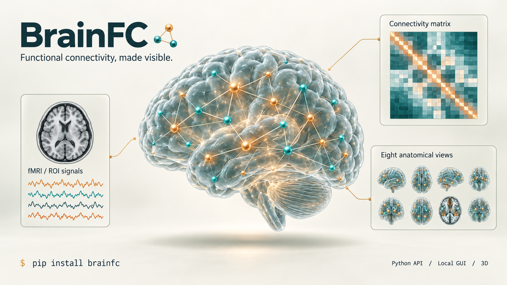
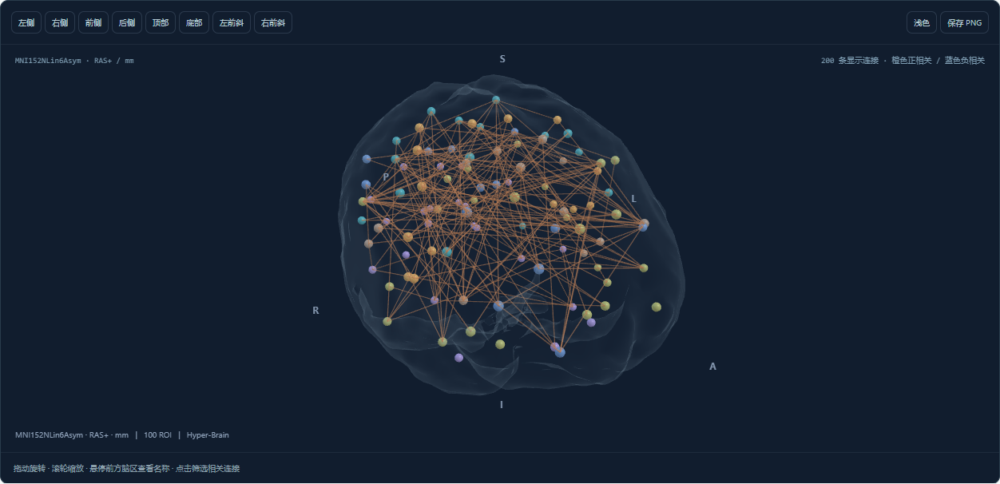
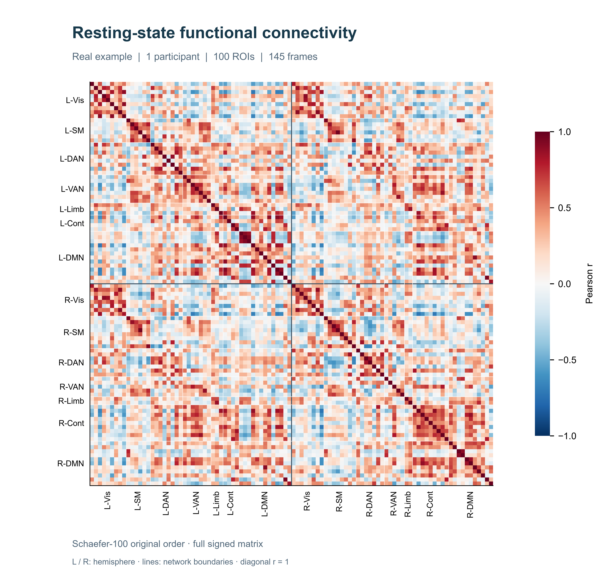
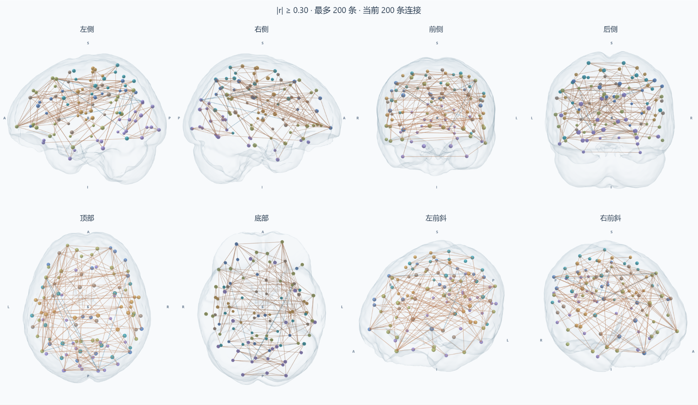
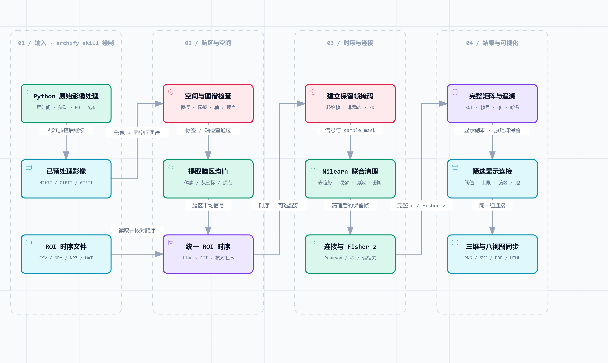

<p align="center"><b>From fMRI and ROI signals to signed connectivity and interactive brain networks.</b><br>One Python package. A local GUI, command-line tools, and a documented scientific API.</p>

<p align="center"><a href="README.md">中文</a> · <b>English</b> · <a href="docs/index.md">Documentation</a> · <a href="docs/api-reference.md">API reference</a> · <a href="https://pypi.org/project/brainfc/">PyPI</a></p>

## Install

**Source version 0.4.0 integrates Hyper-Brain.** PyPI remains at 0.3.0 until the next release. Install the current source with `pip install "brainfc @ git+https://github.com/hanxiangmin/brainfc.git"` for integrated graph/hypergraph analysis. Remove any old `hic-brain` distribution first when reusing the same environment.

Python **3.11+**. The default installation includes the local GUI and offline manual.

```bash
pip install brainfc
brainfc serve
```

Open `http://127.0.0.1:8766` and choose the built-in demo to try the pipeline with synthetic signals. No participant download or Node.js installation is needed. The current GUI and full reference manual are in Chinese; Python API docstrings are in English.

<details>
<summary>Install from source / run a command-line demo</summary>

```bash
 git clone https://github.com/hanxiangmin/brainfc.git
 cd brainfc
 pip install .
 brainfc demo --output demo-001
```

Use the source installation for development or a version not yet uploaded to PyPI. The local manual is at `/reference/`; the HTTP schema is at `/docs`.

</details>

The current source build also includes a [de-identified resting-state example](docs/real-example.md): `brainfc demo --kind rest01 --output rest01-demo`, with processing methods, metadata corrections, and QC records.

## Use

### 1. Start with ROI time series

For signals that already received the required upstream denoising. The TSV has a header, one time point per row, and ROI signal columns only.

```python
from brainfc import Config, extract_connectome

result = extract_connectome(
    "roi_timeseries.tsv",
    config=Config(detrend=False, standardize=False),
)
fc = result.connectivity
z = result.fisher_z
result.save("results/roi-001")
```

Use `table_header=False` for headerless text. Matrix computation and plotting work without coordinates; 3D and eight-view rendering require complete ROI coordinates and a declared space.

### 2. Extract from preprocessed fMRI

Replace the filenames with your BOLD run and row-aligned confound table. The BOLD must already be registered to the declared space.

```python
from brainfc import Config, extract_connectome, fetch_atlas

atlas = fetch_atlas("schaefer100")  # Downloads once, then reuses its cache.
result = extract_connectome(
    "sub-01_space-MNI152NLin6Asym_desc-preproc_bold.nii.gz",
    atlas=atlas["atlas"],
    rois=atlas["rois"],
    confounds="sub-01_desc-confounds_timeseries.tsv",
    config=Config(
        preprocessed=True,
        data_space="MNI152NLin6Asym",
        atlas_space=atlas["space"],
    ),
)
```

Defaults include detrending and standardization, with no band-pass filter or FD-threshold censoring. Select temporal options according to the upstream processing history. Atlas grid resampling does not perform spatial registration.

### 3. Visualize and export

Continue with the image result above:

```python
result.plot_matrix("matrix.svg")
result.plot_views("eight_views.pdf", threshold=0.4, max_edges=150)
result.view("brain-network.html", open_browser=True)
result.save("results/sub-01")
```

`save()` requires a new directory. It exports arrays, tables, ROI order, original frame indices, quality/provenance records, figures, and a self-contained HTML report.

[Runnable example](examples/quickstart.py) · [Batch example](examples/batch_derivatives.py) · [Python guide](docs/python-api.md) · [Complete API](docs/api-reference.md) · [CLI](docs/cli-reference.md) · [HTTP API](docs/http-api.md)

## Graphs and native hypergraphs

Hyper-Brain is now part of the same distribution and local service. Extraction prepares connectivity; `brainfc.network` builds descriptive network structures. Existing `hicbrain` imports delegate to the integrated implementation.

```python
from brainfc.network import AnalysisConfig
from brainfc.network.export import export_result

# result is the Connectome returned by extract_connectome above.
network = result.analyze_network(AnalysisConfig(
    graph_method="density", density=0.1,
    hypergraph_method="multiscale", hypergraph_ks=[5, 10],
))
export_result(network, "network-result.zip")
```

Choose **进入网络分析** after extraction to transfer the complete matrix, ROI order, coordinates and provenance without another upload or temporal processing. Open `/networks/` directly for existing matrices/time series, native hyperedge visualization and participant-level statistics. Constructed hyperedges do not establish irreducible physiological interactions.

[Network guide](docs/network-analysis.md) · [Migration and compatibility](docs/hyper-brain-migration.md) · [Runnable example](examples/network_analysis.py)

## Features

| Capability | What it provides |
| :--- | :--- |
| Multiple inputs | Supported NiBabel volume containers, CIFTI, paired GIFTI, ROI tables/arrays, and fMRIPrep run discovery. |
| Scientific processing | ROI means; joint Nilearn temporal cleaning and censoring; Pearson, Spearman, or Ledoit–Wolf partial correlation. |
| Guided setup | Metadata suggestions, ordered confirmation steps, and source-linked ABIDE/ADNI/ADHD-200/MDD/PPMI presets. |
| Synchronized views | Matrix-to-ROI selection; shared thresholds, edge limits, and ROI/edge selections in 3D and eight views. |
| Traceable results | Full signed matrices, separate Fisher-z, parameters, QC, input hashes, ROI order, and original frame indices. |
| Local operation | Shared Python/CLI/GUI core, local data processing, and offline interactive reports. |



<table>
<tr><th width="50%">Full connectivity matrix</th><th width="50%">Synchronized eight views</th></tr>
<tr><td><a href="docs/assets/matrix.png"></a></td><td><a href="docs/assets/eight-views.png"></a></td></tr>
</table>

These outputs use the [**reviewed, de-identified resting-state example rest01**](docs/real-example.md): one participant, 100 Schaefer ROIs and 145 retained frames. The full Pearson matrix retains the original ROI order and a fixed −1 to +1 color scale. L/R denotes hemisphere; lines indicate network boundaries. No clustering, reordering or smoothing is applied. The 3D and eight-view displays use the same selected edges; their filters do not change the matrix. The header remains conceptual artwork.

Earlier screenshots used synthetic signals whose repeated groups produced periodic diagonal stripes. The current figures show the real computation. Reproduce the matrix with `python scripts/render_example_matrix.py --output matrix-demo`; see the [privacy review](docs/privacy-review.md) and [figure provenance](docs/assets/matrix-provenance.json). This is a single-participant software example without slice-timing or susceptibility-distortion correction.

## Processing workflow



[Vector SVG](docs/assets/processing.svg) · [Download interactive HTML](docs/assets/processing.html) · [Editable specification](docs/assets/processing.dataflow.json) · [Methods](docs/processing.md)

ROI tables enter at the unified ROI time-series stage. Raw images need external **dcm2niix → BIDS → fMRIPrep**, followed by report inspection and re-import. These external tools are not included in the pip package; the complete external raw-data chain has not been validated in this release. BrainFC does not provide disease diagnosis, task GLM, or cohort-level inference. See [input contracts](docs/formats.md), [validation](docs/validation-v0.3.0.md), and [output schemas](docs/outputs.md).

## License and credits

Copyright © 2026 BrainFC contributors. [Apache License 2.0](LICENSE). Citation metadata: [CITATION.cff](CITATION.cff).

Built on NumPy, SciPy, NiBabel, Nilearn, scikit-learn, Matplotlib, React, and Three.js. The 3D component is adapted from [Hyper-Brain](https://github.com/hanxiangmin/Hyper-Brain); BrainFC installs and runs independently. Workflow artwork uses the [archify skill](https://github.com/tt-a1i/archify). See [NOTICE](NOTICE) and [third-party licenses](src/brainfc/web/static/THIRD_PARTY_NOTICES.txt). Atlas and dataset licenses remain with their providers; participant data are not distributed here.

[Contributing](CONTRIBUTING.md) · [Release guide](docs/release.md) · [Issues](https://github.com/hanxiangmin/brainfc/issues)
