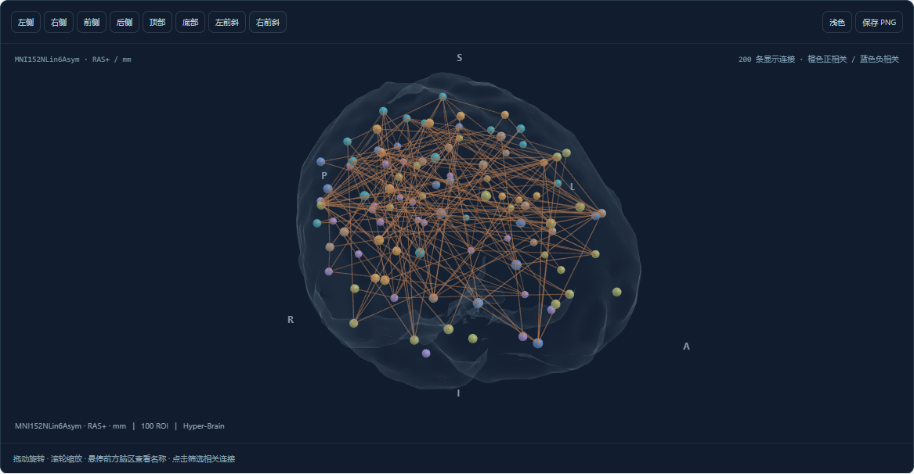

# BrainFC

[English](README.en.md) · [完整文档](docs/index.md) · [全部函数/API](docs/api-reference.md) · [HTTP API](docs/http-api.md) · [命令行](docs/cli-reference.md)

一个独立、可 pip 安装的 Python 库：**fMRI → 脑区时序 → 功能连接矩阵 → 八视图 / 交互三维**。

中文本地网页与 Python API 共用处理核心。三维球棍组件复用 Hyper-Brain 0.3.0；无需安装原项目，不需要 Node.js，也不将数据发送到外部服务。源码位于 [hanxiangmin/brainfc](https://github.com/hanxiangmin/brainfc)，可用发行版本以 [PyPI 项目页](https://pypi.org/project/brainfc/) 为准。



*真实 Schaefer 图谱与参考脑，合成 fMRI 信号；画面不代表患者结果。*

## 安装与启动

Python 3.11+。安装 PyPI 已发布版本并启动：

```shell
pip install brainfc
brainfc serve
```

如果目标版本尚未发布，或需要使用源码版，在本目录安装：

```powershell
python -m pip install .
brainfc serve
```

打开 `http://127.0.0.1:8766`。默认安装同时提供 Python API、命令行和本地网页。在界面点击“试用演示”即可走完真实的 NIfTI 读取、脑区均值提取、去噪、矩阵计算与导出；演示数据为合成信号。

Windows 可在安装后双击本目录的 `启动界面.cmd`。运行服务后，`/reference/` 是随包离线手册，`/docs` 是 HTTP 接口交互说明。原始下载清单见下方数据文档。

也可离线安装已构建的 wheel（Python 依赖须已缓存或安装）：

```powershell
pip install "dist/brainfc-0.3.0-py3-none-any.whl"
```

## Python API

```python
from brainfc import Config, extract_connectome, fetch_atlas

atlas = fetch_atlas("schaefer100")  # 首次显式下载；之后复用本地缓存
result = extract_connectome(
    "sub-01_task-rest_space-MNI152NLin6Asym_desc-preproc_bold.nii.gz",
    atlas=atlas["atlas"], rois=atlas["rois"],
    confounds="sub-01_task-rest_desc-confounds_timeseries.tsv",
    config=Config(
        preprocessed=True,
        data_space="MNI152NLin6Asym", atlas_space=atlas["space"],
        t_r=2.0, high_pass=0.01, low_pass=0.08,
        fd_threshold=0.5, method="pearson",
    ),
)
fc = result.connectivity        # ROI × ROI，原始有符号 r；对角线 1
z = result.fisher_z             # 单独的 Fisher-z，对角线 0
ts = result.timeseries          # 清理后的 time × ROI
result.save("outputs/sub-01_run-01")  # 新目录；已有目录会拒绝覆盖
result.plot_views("eight_views.pdf", threshold=0.4, max_edges=150)
# 可选：只显示指定脑区的相关连接（先筛选脑区，再按强度取前 150 条）
result.plot_views("selected.pdf", threshold=0.4, max_edges=150,
                  selection={"kind": "node", "id": result.rois[0]["roi_id"]})
result.view("interactive.html", open_browser=True)
```

过滤阈值是示例参数，非跨数据集统一标准。若上游已过滤、去噪，应关闭相应选项，避免重复处理。默认不做频带滤波；默认去趋势并标准化。

ROI 时序也可直接使用：

```python
result = extract_connectome(
    "timeseries.tsv", rois="rois.tsv",
    config=Config(data_space="MNI152NLin6Asym", detrend=False),
)
# 若未安装 Hyper-Brain，此可选接口不会影响主库。
# dataset = result.to_hicbrain()
```

表格只包含 ROI 信号列；不包含时间、受试者或行号列。CSV/TSV 默认首行为列名；无表头 TXT/1D/CSV 用 `Config(table_header=False)`。矩阵方向默认 `time × ROI`，需要转置时显式设置 `transpose=True`。多变量 MAT/NPZ 用 `variable="ROISignals"` 指定。

## 输入与需要提供的数据

| 输入 | 必需搭配 | 支持范围 |
|---|---|---|
| 4D `.nii/.nii.gz`、Analyze `.hdr/.img`、MGH/MGZ、AFNI HEAD/BRIK | 已预处理；整数分区图谱；明确一致的空间 | NiBabel 读取，分块提取脑区均值 |
| CIFTI `.dtseries.nii` | 同一 BrainModelAxis 的 `.dlabel.nii` | 严格核对灰坐标轴，不按长度猜对齐 |
| CIFTI `.ptseries.nii` | 自带 ParcelsAxis；可选坐标表 | 直接读取已分区时序 |
| GIFTI `.func.gii` | 同一表面/半球/顶点顺序的 `.label.gii` | 单个配对表面；依赖调用者声明顶点对应 |
| CSV/TSV/TXT/1D/NPY/NPZ/MAT | 明确 ROI 顺序；绘图另需坐标 | 实数二维时序；不支持 MAT v7.3/HDF5 |
| fMRIPrep derivatives 文件夹 | 图谱、空间、配置 | 界面选单 run；CLI batch 每个 run 独立导出 |
| DICOM / 未预处理 BIDS | BOLD、T1、采集 JSON；场图如有 | 外部 dcm2niix / fMRIPrep 适配器，见下文 |

影像读取兼容范围和实际已测格式分别见 [验证记录](docs/validation-v0.3.0.md)。输入必须是真正的时序；引导检查拒绝疑似静态相关矩阵，底层数值 API 不自动判断时序的科学来源。

第一次提供**一个受试者、一次扫描**即可：

- 已预处理：4D BOLD + 同名 JSON/TR + 配准空间 + confounds TSV（如有）+ 脑掩膜（推荐）。
- 原始：BOLD + T1 + 采集 JSON；相位编码/读出时间及场图（如有）。DICOM 保留完整序列。
- ROI 时序：信号文件 + 列顺序/图谱说明；三维展示需要逐 ROI 的坐标。

自定义 ROI 表：影像标签需 `label_value,roi_id,name`；表格和 ptseries 用 `roi_id,name`。可增加 `x,y,z,hemisphere,network,abbreviation`。`label_value` 是体素内真实标签值，不是矩阵行号。标签必须准确覆盖全部提取 ROI，不根据矩阵大小猜图谱。

**空间约定：** AAL SPM12 为 MNIColin27，Schaefer 为 MNI152NLin6Asym，二者不能因同属“MNI”就混用。仅做图谱到 BOLD 网格的最近邻重采样，不估计配准。自定义表面空间需声明相同模板/半球和顶点顺序。NIfTI 空间单位 unknown 时按 mm 解释并记录警告，需核对来源；米/微米单位会拒绝。

## 从扫描仪原始数据开始

不是用简单相关计算代替预处理。流程为 **DICOM → NIfTI/JSON → BIDS → fMRIPrep → 本库**。

```powershell
brainfc dicom D:/data/dicom --output D:/data/converted
# 默认显示命令；加 --run 调用外部 dcm2niix。

brainfc preprocess D:/data/bids --output D:/data/derivatives --license D:/license.txt --participant 01
# 检查命令后加 --run，或在本地界面生成并运行。
```

dcm2niix 不随 pip 包安装，需安装外部可执行文件。转换输出需按采集信息整理成 BIDS；不能从文件名猜扫描序列。fMRIPrep 固定镜像 `nipreps/fmriprep:25.2.5`，需要 Docker Linux 容器、FreeSurfer license、模板资源、CPU/内存；Windows 可通过 Docker Desktop/WSL2 运行。fMRIPrep 报告须检查配准和头动后再进入提取。

## 界面与导出

- 常用流程只有三步：**选择数据 → 确认处理方案 → 开始处理**。后续步骤按顺序解锁，返回修改会使后续复核失效。
- 数据来源可不选；也可选择 ABIDE、ADNI、ADHD-200、MDD、PPMI 的具体方案。仅有明确依据的采集参数预填，扫描元数据优先，参见 [官方预设与自动填写说明](docs/presets-and-workflow.md)。
- 自动识别影像 / 时序、文本表头、TR、文件中的空间标识和严格匹配的 fMRIPrep 配套文件。已知标准空间可自动载入建议图谱；无法确定时才需补充。高级参数默认收起。
- 原始数据会先展开转换、BIDS、预处理和质控子流程。转换与预处理输出目录自动生成，已有 `FS_LICENSE` 可自动使用。
- 本地路径或上传文件；图谱自动匹配或手动更换；fMRIPrep run 扫描；后台任务与持久化历史。
- 矩阵热图与脑区选择；3D 旋转、缩放、正负边、阈值、脑壳可见度、深浅主题和截图。名称仅在悬停前方脑区时出现；保留完整名称和 ROI 标识。
- 八视图：左、右、前、后、顶、底、左前斜、右前斜。与三维共用阈值、连接数、选中脑区 / 边、颜色与脑壳可见度。
- `connectivity.csv/.npy`、`fisher_z.csv/.npy`、`timeseries.tsv/.npy`、`rois.tsv`、`samples.tsv`。
- `matrix` 与 `eight_views` 的 PNG（300 dpi）/SVG/PDF；`report.html` 内嵌可交互三维；`qc.json`、`provenance.json`、文件 SHA-256 清单；界面提供 ZIP。

可视化阈值只控制显示边，不修改数值矩阵。初始显示 |r|≥0.3、最多200边；界面八视图和 PNG 导出随当前选择更新。SVG/PDF 是同一连接集合的矢量投影；材质与 WebGL PNG 不完全相同。完整结果 ZIP 中的静态图保留生成时的默认设置，当前筛选请用八视图面板导出。未给解剖参考时，灰色表面是“图谱覆盖包络”，不是真实皮层表面；提供同空间脑掩膜/去颅骨 T1 可生成对应参考表面。平滑仅作用于显示表面，不改变 ROI 坐标或矩阵。没有 ROI 坐标时只输出矩阵。

`result.view()` 和 `result.save()` 的离线 HTML 均可在本机重新生成同步八视图，无需服务器。旧版已导出的 HTML 保留旧版脚本；重新导出到新文件即可使用新版。导出的报告含输入路径和文件校验值。

## 方法

体积影像分块读取，每个 ROI 取体素均值。先移除指定起始帧，再用 Nilearn `signal.clean` 联合处理滤波、混杂回归和删帧。fMRIPrep 自动混杂列为 motion6 + 可用 WM/CSF；全局信号回归、24参数模型等需明确指定列。非稳态帧自动删除；FD 首帧缺失在启用 FD 删帧时排除，其余缺失 FD 报错。

Pearson 为样本相关，Spearman 为秩相关，偏相关为 Ledoit–Wolf 收缩精度矩阵归一化。Fisher-z 在 ±1−1e−7 截断后单独存储。零方差 ROI、缺失脑区、空间冲突、非有限值、时序/混杂长度不符和过少保留帧均报错。保留原始体积索引用于回溯。阈值不会被解释为显著性检验；本库不执行疾病诊断、任务 GLM 或组间统计推断。

## 批量与开发

```powershell
brainfc batch D:/data/derivatives --atlas atlas.nii.gz --rois rois.tsv --config config.json --output outputs/batch-001
pip install -e ".[dev]"
pytest
python -m build
python -m twine check dist/*
```

批处理逐次扫描独立导出，失败写入 `batch.json`，不拼接不同受试者；有失败返回非零退出码。

修改界面时才需 Node.js，详见 [贡献说明](CONTRIBUTING.md)。构建资产和离线 API 手册随 wheel 安装。源码许可 Apache-2.0；第三方声明见 NOTICE 和随包文件。

参考：[现有工具调研](docs/research.md) · [数据集下载与入口](docs/datasets.md) · [0.3.0 验证记录](docs/validation-v0.3.0.md) · [GitHub/PyPI 发布准备](docs/release.md)。
